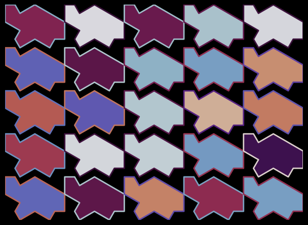

# matplotlib-based generator

I implemented a class to poop out 
copies of the "turtle" aperiodic monotile to be 
used with matplotlib. Can work with any 
compatible SVG in theory.

## Requirements
- matplotlib (anything after 2021)
- numpy
- svg.path (on PyPI (pip), no idea about anaconda)

## Example

Run `turtles.py` as a script.
